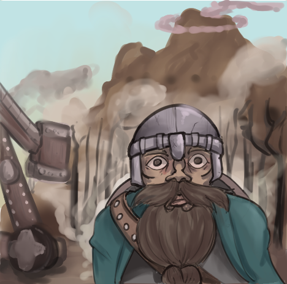
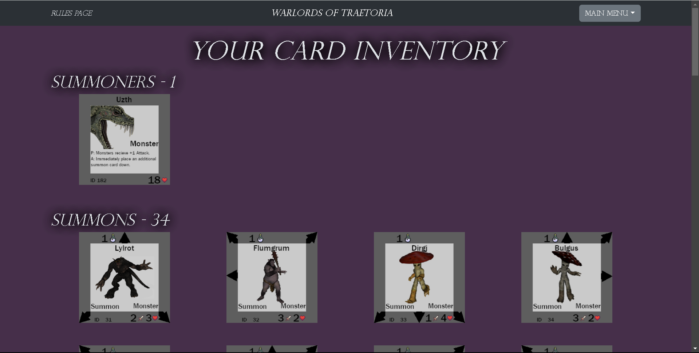
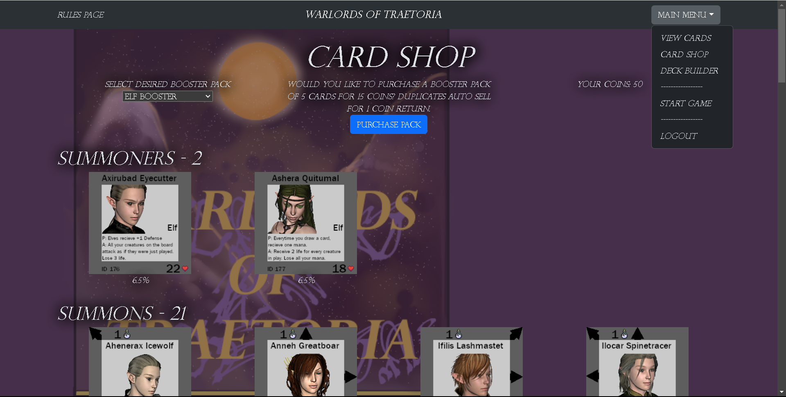
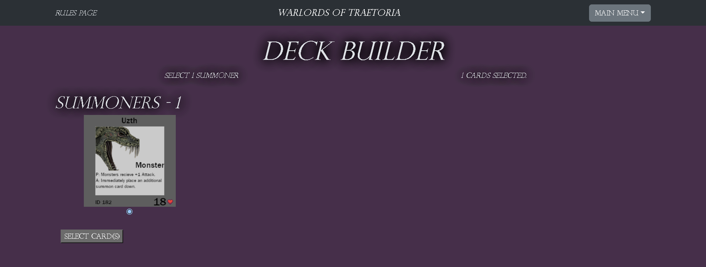
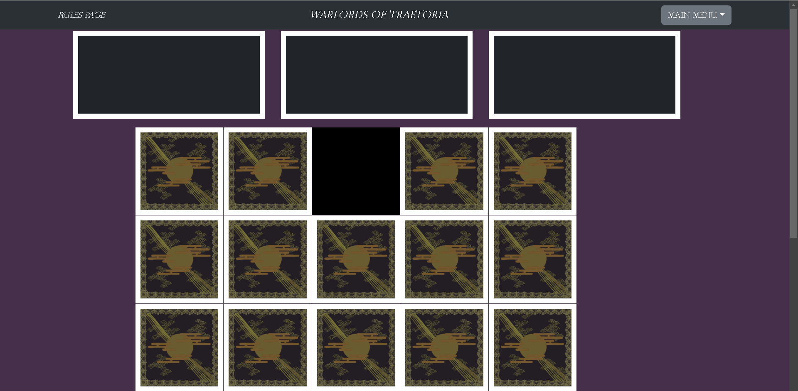
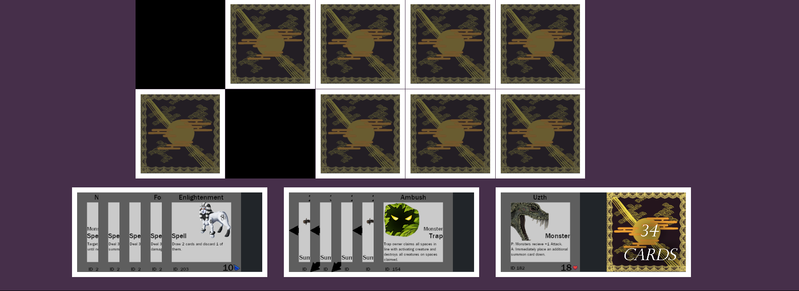

# Warlords of Ravagea

## Description

Warlords of Ravagea is a tactical grid based card game inspired by Magic the Gathering and Triple Triad: Originally a Mini Game within Final Fantasy VIII.

This game was created as a group project in an edX Full Stack Development Bootcamp. It showcases a variety of technology such as React, JavaScript, Mongoose and Bootstrap. It also showcases a fair amount of case specific items such as Drag and Drop done with only useState, Context data, session storage, password encryption and stripping, and interaction for users to create a deck of cards, get some booster packs, and adjust as they see fit. This project was done in a 1 week time crunch from concept to creation and showcases the desire to think outside the box while pushing further down coding rabbit hole.

## Table of Contents

- [Links](#links)
- [Technical Requirements](#technicalrequirements)
- [Credits](#credits)
- [site preview](#sitepreview)
- [License](#license)

  

  

## Links
The deployed website can be accessed [here](https://warlordsoftraetoria-a6c327028c9d.herokuapp.com/)

The associated GitHub repo can be accessed [here](https://github.com/kylatae/tcg)

  

## Tech Stack

  

## Credits
This project was done in conjunction with the U of MN EdX full-stack Bootcamp Fall 2023.

This site was created by:

[Arthur Henningfield](https://github.com/kylatae)

[Jackson Stang](https://github.com/JStang98)

[Samiye Ahsan](https://github.com/samiyeahsan)

[Matt Stark](https://github.com/Matt0Stark)

  

## Site Preview

  

## License
MIT 