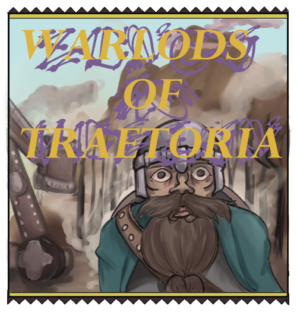

# Warlords of Ravagea

## Description

## Table of Contents

- [Links](#links)
- [Technical Requirements](#technicalrequirements)
- [Credits](#credits)
- [site preview](#sitepreview)
- [License](#license)

  

  

## Links
The deployed website can be accessed [here](https://warlordsoftraetoria-a6c327028c9d.herokuapp.com/)

The associated GitHub repo can be accessed [here](https://github.com/kylatae/tcg)

  

## Tech Stack

  

## Credits
This project was done in conjunction with the U of MN EdX full-stack Bootcamp Fall 2023.

This site was created by:

[Arthur Henningfield](https://github.com/kylatae)

[Jackson Stang](https://github.com/JStang98)

[Samiye Ahsan](https://github.com/samiyeahsan)

[Matt Stark](https://github.com/Matt0Stark)

  

## Site Preview

  

## License
MIT 